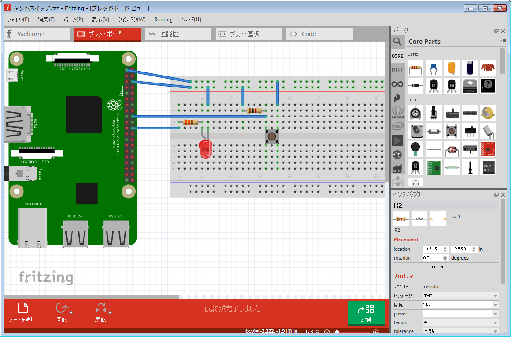
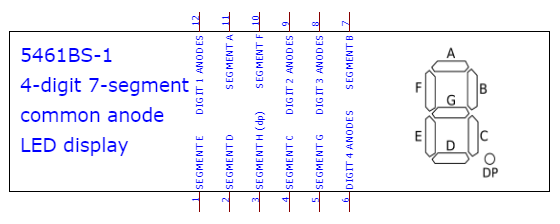
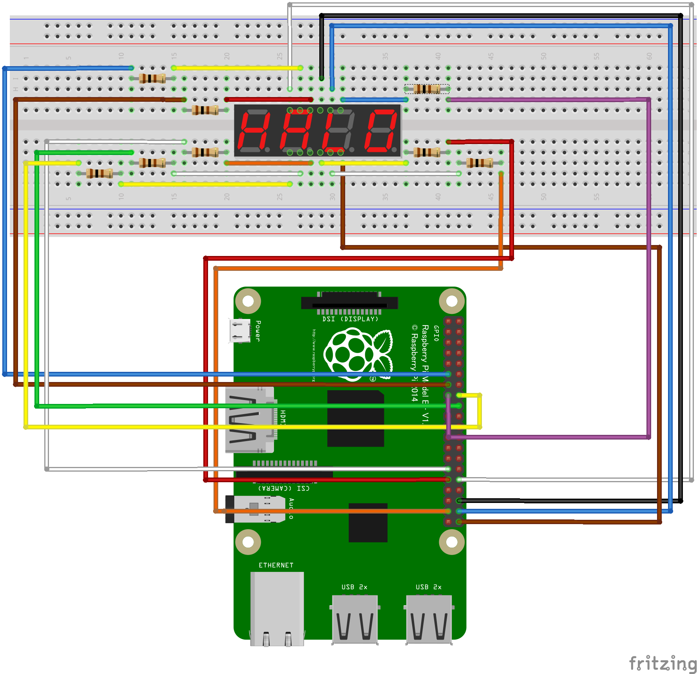

## 問題7. ボタンでLEDを光らせる
- タクトスイッチを使用し、タクトスイッチが押されている間だけLEDが光るプログラムを作成してください。
- ホームにbutton_ledディレクトリを作成し、その中にbutton_led.cを作成することとする。
- 配線は以下の通り。
### button_led.cの中身
```C
#include <stdio.h>
#include <fcntl.h>
#include <unistd.h>

int main(void) {
    int fd;
    char val[2];

    // GPIO25をエクスポート

    // GPIO25を出力に設定
    
    // GPIO24をエクスポート
    
    // GPIO24を入力に設定

    while (1) {
        // GPIO24の値を取得
        fd = open("/sys/class/gpio/gpio24/value", O_RDONLY);
        read(fd, val, 1);
        close(fd);

        // GPIO24が1なら光らせる
        if (val[0] == '1') {
            // 光らせる

        } else { // GPIO24が0なら消灯する
            // 消灯する
        }

        // 100000ミリ秒待機
    }

    return 0;
}

```

## 問題8. 4桁セグメントディスプレイを表示する
### 準備
1. 4桁の7セグメントディスプレイを準備する。
1. セグの上下には合計12本のピンがある。それぞれの名称は以下の通り。
   
     - DIGIT 1 ANODE: 千の位を点灯させるためのピン
     - DIGIT 2 ANODE: 百の位を点灯させるためのピン
     - DIGIT 3 ANODE: 十の位を点灯させるためのピン
     - DIGIT 4 ANODE: 一の位を点灯させるためのピン
   -  すべてdirectionを"out"(出力)に、valueを"1"(high)に設定すると3v3 powerとして機能する。
1. 下記の図のとおり接続する。
   
### (1) Linuxコマンドで「2」を点灯させてみる
1. 以下のすべてのGPIOをエクスポートし、出力方向を"out"に設定する
    - 17, 27, 22, 23, 24, 5, 6, 26, 12, 16, 20, 21
2. GPIO12の値を1に設定(1桁目を点灯に設定)
3. GPIO16, 20, 21の値を0に設定(2-4桁目は消灯させる)
4. GPIO17, 22, 24, 23, 26の値を0に、GPIO6, 27, 5の値を1に設定
5. "2"が点灯する
6. GPIO16の値を1にすると2桁目が、GPIO20の値を1にすると3桁目が、GPIO21の値を1にすると4桁目が点灯する
7. 2が点灯したらすべて消灯させる
    - GPIO12, 16, 20, 21の値を0に設定
    - GPIO17, 22, 24, 23, 26の値を1に設定
8. 以下のすべてのGPIOをアンエクスポートする
    - 17, 27, 22, 23, 24, 5, 6, 26, 12, 16, 20, 21
9. 以下のプログラムで点灯させてみる  
```C
// on2.c
#include <stdio.h>
#include <fcntl.h>
#include <unistd.h>

void standby(void);
void deleteFile(void);

int main(void)
{
    standby();

    int fd = 0;

    // 1桁目のみつける
    fd = open("/sys/class/gpio/gpio12/value", O_WRONLY);
    write(fd, "1", 1);
    close(fd);
    fd = open("/sys/class/gpio/gpio16/value", O_WRONLY);
    write(fd, "0", 1);
    close(fd);
    fd = open("/sys/class/gpio/gpio20/value", O_WRONLY);
    write(fd, "0", 1);
    close(fd);
    fd = open("/sys/class/gpio/gpio21/value", O_WRONLY);
    write(fd, "0", 1);
    close(fd);

    // 2を点灯させる
    fd = open("/sys/class/gpio/gpio17/value", O_WRONLY);
    write(fd, "0", 1);
    close(fd);
    fd = open("/sys/class/gpio/gpio22/value", O_WRONLY);
    write(fd, "0", 1);
    close(fd);
    fd = open("/sys/class/gpio/gpio24/value", O_WRONLY);
    write(fd, "0", 1);
    close(fd);
    fd = open("/sys/class/gpio/gpio23/value", O_WRONLY);
    write(fd, "0", 1);
    close(fd);
    fd = open("/sys/class/gpio/gpio26/value", O_WRONLY);
    write(fd, "0", 1);
    close(fd);
    fd = open("/sys/class/gpio/gpio6/value", O_WRONLY);
    write(fd, "1", 1);
    close(fd);
    fd = open("/sys/class/gpio/gpio27/value", O_WRONLY);
    write(fd, "1", 1);
    close(fd);
    fd = open("/sys/class/gpio/gpio5/value", O_WRONLY);
    write(fd, "1", 1);
    close(fd);

    usleep(1000000);

    // 消灯させる
    fd = open("/sys/class/gpio/gpio16/value", O_WRONLY);
    write(fd, "0", 1);
    close(fd);
    fd = open("/sys/class/gpio/gpio17/value", O_WRONLY);
    write(fd, "1", 1);
    close(fd);
    fd = open("/sys/class/gpio/gpio22/value", O_WRONLY);
    write(fd, "1", 1);
    close(fd);
    fd = open("/sys/class/gpio/gpio24/value", O_WRONLY);
    write(fd, "1", 1);
    close(fd);
    fd = open("/sys/class/gpio/gpio23/value", O_WRONLY);
    write(fd, "1", 1);
    close(fd);
    fd = open("/sys/class/gpio/gpio26/value", O_WRONLY);
    write(fd, "1", 1);
    close(fd);

    deleteFile();

    return 0;
}
```

```C
// standby.c
#include <stdio.h>
#include <fcntl.h>
#include <unistd.h>

void standby(void)
{
    int fd = 0;
    fd = open("/sys/class/gpio/export", O_WRONLY);
    write(fd, "17", 2);
    close(fd);
    usleep(100000);
    fd = open("/sys/class/gpio/gpio17/direction", O_WRONLY);
    write(fd, "out", 3);
    close(fd);

    fd = open("/sys/class/gpio/export", O_WRONLY);
    write(fd, "27", 2);
    close(fd);
    usleep(100000);
    fd = open("/sys/class/gpio/gpio27/direction", O_WRONLY);
    write(fd, "out", 3);
    close(fd);

    fd = open("/sys/class/gpio/export", O_WRONLY);
    write(fd, "22", 2);
    close(fd);
    usleep(100000);
    fd = open("/sys/class/gpio/gpio22/direction", O_WRONLY);
    write(fd, "out", 3);
    close(fd);

    fd = open("/sys/class/gpio/export", O_WRONLY);
    write(fd, "23", 2);
    close(fd);
    usleep(100000);
    fd = open("/sys/class/gpio/gpio23/direction", O_WRONLY);
    write(fd, "out", 3);
    close(fd);

    fd = open("/sys/class/gpio/export", O_WRONLY);
    write(fd, "24", 2);
    close(fd);
    usleep(100000);
    fd = open("/sys/class/gpio/gpio24/direction", O_WRONLY);
    write(fd, "out", 3);
    close(fd);

    fd = open("/sys/class/gpio/export", O_WRONLY);
    write(fd, "5", 2);
    close(fd);
    usleep(100000);
    fd = open("/sys/class/gpio/gpio5/direction", O_WRONLY);
    write(fd, "out", 3);
    close(fd);

    fd = open("/sys/class/gpio/export", O_WRONLY);
    write(fd, "6", 2);
    close(fd);
    usleep(100000);
    fd = open("/sys/class/gpio/gpio6/direction", O_WRONLY);
    write(fd, "out", 3);
    close(fd);

    fd = open("/sys/class/gpio/export", O_WRONLY);
    write(fd, "26", 2);
    close(fd);
    usleep(100000);
    fd = open("/sys/class/gpio/gpio26/direction", O_WRONLY);
    write(fd, "out", 3);
    close(fd);

    fd = open("/sys/class/gpio/export", O_WRONLY);
    write(fd, "12", 2);
    close(fd);
    usleep(100000);
    fd = open("/sys/class/gpio/gpio12/direction", O_WRONLY);
    write(fd, "out", 3);
    close(fd);

    fd = open("/sys/class/gpio/export", O_WRONLY);
    write(fd, "16", 2);
    close(fd);
    usleep(100000);
    fd = open("/sys/class/gpio/gpio16/direction", O_WRONLY);
    write(fd, "out", 3);
    close(fd);

    fd = open("/sys/class/gpio/export", O_WRONLY);
    write(fd, "20", 2);
    close(fd);
    usleep(100000);
    fd = open("/sys/class/gpio/gpio20/direction", O_WRONLY);
    write(fd, "out", 3);
    close(fd);

    fd = open("/sys/class/gpio/export", O_WRONLY);
    write(fd, "21", 2);
    close(fd);
    usleep(100000);
    fd = open("/sys/class/gpio/gpio21/direction", O_WRONLY);
    write(fd, "out", 3);
    close(fd);

    return;
}
```

```C
// deleteFile.c
#include <stdio.h>
#include <fcntl.h>
#include <unistd.h>

void deleteFile(void)
{
    int fd = 0;
    fd = open("/sys/class/gpio/unexport", O_WRONLY);
    write(fd, "17", 2);
    close(fd);

    fd = open("/sys/class/gpio/unexport", O_WRONLY);
    write(fd, "27", 2);
    close(fd);

    fd = open("/sys/class/gpio/unexport", O_WRONLY);
    write(fd, "22", 2);
    close(fd);

    fd = open("/sys/class/gpio/unexport", O_WRONLY);
    write(fd, "23", 2);
    close(fd);

    fd = open("/sys/class/gpio/unexport", O_WRONLY);
    write(fd, "24", 2);
    close(fd);

    fd = open("/sys/class/gpio/unexport", O_WRONLY);
    write(fd, "5", 2);
    close(fd);

    fd = open("/sys/class/gpio/unexport", O_WRONLY);
    write(fd, "6", 2);
    close(fd);

    fd = open("/sys/class/gpio/unexport", O_WRONLY);
    write(fd, "26", 2);
    close(fd);

    fd = open("/sys/class/gpio/unexport", O_WRONLY);
    write(fd, "12", 2);
    close(fd);

    fd = open("/sys/class/gpio/unexport", O_WRONLY);
    write(fd, "16", 2);
    close(fd);

    fd = open("/sys/class/gpio/unexport", O_WRONLY);
    write(fd, "20", 2);
    close(fd);

    fd = open("/sys/class/gpio/unexport", O_WRONLY);
    write(fd, "21", 2);
    close(fd);

    return;
}
```

### (2) 一番左の桁に1から4までの数字を順に点灯させる(oneToFour.c)
1. 必要なGPIOをエクスポートする(standby)
2. GPIO12を1に、GPIO16, 20, 21を0に設定する
3. 1を表示して1秒待機する
4. 2を表示して1秒待機する
5. 3を表示して1秒待機する
6. 4を表示して1秒待機する
7. 消灯してアンエクスポートする(deleteFile)

### (3) 一番左の桁で9から0までのカウントダウンを行う(countdown.c)
1. 必要なGPIOをエクスポートする(standby)
2. GPIO12を1に、GPIO16, 20, 21を0に設定する
3. 9～0を表示して1秒待機する
4. 消灯してアンエクスポートする(deleteFile)

### (4) 4桁の数字を表示する(showStaticNumber.c)
- 4桁の7セグでは、同時に複数の異なる数字を別々の桁に表示することはできません。
- そこで、以下の操作を短いサイクルで大量に繰り返すことで4桁の数字を表示しているように見せるます。
  - 1桁目に「1」を表示してから消灯し、
  - 2桁目に「2」を表示してから消灯し、
  - 3桁目に「3」を表示してから消灯し、
  - 4桁目に「4」を表示してから消灯する
  - これを各ステップ2マイクロ秒で繰り返すプログラムを作成しましょう。
  
### (5) スクロールテキストを表示する(showScrollText.c)
- 「HELLO」という文字列が右から流れてくるプログラムを作成しましょう。
- 以下のように遷移します(_は全て消灯)
  - "____"
  - "___H"
  - "__HE"
  - "_HEL"
  - "HELL"
  - "ELLO"
  - "LLO_"
  - "LO__"
  - "O___"
  - "____"

### (6) 現在時刻を表示する
```C
// showTime.c

#include <stdio.h>
#include <fcntl.h>
#include <unistd.h>
#include <time.h> // time, localtime, struct tm
#define GPIO "/sys/class/gpio"
#define EXPORT "/sys/class/gpio/export"
#define UNEXPORT "/sys/class/gpio/unexport"
#define GPIO_ARR_SIZE 12 // 使用するGPIOの数
#define BLINK_LENGTH 3000 // 何回くりかえすか
#define DEBUG

char *gpio_arr[GPIO_ARR_SIZE] = {"17", "22", "6", "24", "23", "27", "26", "5", "12", "16", "20", "21"};

char *nums[10][7] = {
    {"17", "22", "6", "24", "23", "27"},       // 0
    {"22", "6"},                               // 1
    {"17", "22", "24", "23", "26"},            // 2
    {"17", "22", "6", "24", "26"},             // 3
    {"22", "6", "27", "26"},                   // 4
    {"17", "6", "24", "27", "26"},             // 5
    {"17", "6", "24", "23", "27", "26"},       // 6
    {"17", "22", "6"},                         // 7
    {"17", "22", "6", "24", "23", "27", "26"}, // 8
    {"17", "22", "6", "24", "27", "26"},       // 9
};

void standby(void)
{
    int fd = 0;
    char path[33];
    for (int i = 0; i < GPIO_ARR_SIZE; i++)
    {
        fd = open(EXPORT, O_WRONLY);
        write(fd, gpio_arr[i], 2);
        close(fd);
#ifdef DEBUG
        fprintf(stderr, "export GPIO %s\n", gpio_arr[i]);
#endif
        usleep(100000);
        sprintf(path, "%s/gpio%s/direction", GPIO, gpio_arr[i]);
        fd = open(path, O_WRONLY);
        write(fd, "out", 3);
        close(fd);
    }
    return;
}

void deleteFile(void)
{
    int fd = 0;
    char path[33];
    for (int i = 0; i < GPIO_ARR_SIZE; i++)
    {
        fd = open(UNEXPORT, O_WRONLY);
        write(fd, gpio_arr[i], 2);
        close(fd);
#ifdef DEBUG
        fprintf(stderr, "unexport GPIO %s\n", gpio_arr[i]);
#endif
    }
    return;
}

void write_value(char *gpio, char *value)
{
    int fd = 0;
    char path[31];
    sprintf(path, "%s/gpio%s/value", GPIO, gpio);
    fd = open(path, O_WRONLY);
    write(fd, value, 2);
    close(fd);
    return;
}

void blink(int digit, int num)
{
    int fd = 0;
    char path[31];
    switch (digit)
    {
    case 1:
        write_value("12", "1");
        write_value("16", "0");
        write_value("20", "0");
        write_value("21", "0");
        break;
    case 2:
        write_value("12", "0");
        write_value("16", "1");
        write_value("20", "0");
        write_value("21", "0");
        break;
    case 3:
        write_value("12", "0");
        write_value("16", "0");
        write_value("20", "1");
        write_value("21", "0");
        break;
    case 4:
        write_value("12", "0");
        write_value("16", "0");
        write_value("20", "0");
        write_value("21", "1");
        break;
    default:
        write_value("12", "0");
        write_value("16", "0");
        write_value("20", "0");
        write_value("21", "0");
        break;
    }
    for (int i = 0; i < 7; i++)
    {
        if (nums[num][i] == NULL)
            break;
        write_value(nums[num][i], "0");
    }
    return;
}

void clear(void)
{
    int fd = 0;
    char path[31];
    for (int i = 0; i < GPIO_ARR_SIZE; i++)
    {
        write_value(gpio_arr[i], "1");
    }
}

// Practice 7-7
int main(void)
{
    time_t now;
    struct tm *t;
    int first;  // first digit
    int second; // second digit
    int third;  // third digit
    int fourth; // fourth digit
    int cnt = 0;
    standby();
    while (1)
    {
        now = time(NULL);         // get now
        t = localtime(&now);      // cast now to localtime
        first = t->tm_hour / 10;  // first digit of hour
        second = t->tm_hour % 10; // second digit of hour
        third = t->tm_min / 10;   // first digit of min
        fourth = t->tm_min % 10;  // second digit of min
        clear();
        blink(1, first);
        usleep(2);
        clear();
        blink(2, second);
        write_value("5", "0");
        usleep(2);
        clear();
        blink(3, third);
        usleep(2);
        clear();
        blink(4, fourth);
        usleep(2);
        cnt++;
        if (cnt > BLINK_LENGTH)
        {
            clear();
            deleteFile();
            break;
        }
    }
    return 0;
}
```
